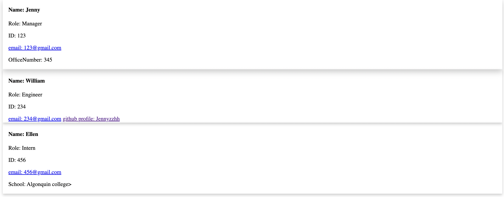

# Object-Oriented Programming Challenge: Team Profile Generator

## Description

- This project enables the audience to take in information about employees on a software engineering team and generates an HTML webpage that displays summaries for each person.

## Usage

- This project dynamically generates a professional HTML webpage from the user's input. User just need to simply answer the prompted questions. 

## Images

## Video 

[Video link] (https://drive.google.com/file/d/1CJzhbUVaE0qPJ9lsFoDsvKTPvjMu0_7i/view)

## deployed application

[Github link] (https://github.com/Jennyzzhh/Module-10-Object-Oriented-Programming-Challenge-Team-Profile-Generator.git)